# 🔒 CI/CD Security Upgrade Documentation

## Overview

This document describes the comprehensive security-focused CI/CD upgrades implemented to enforce code quality, security checks, and prevent bypassing of critical tests.

## 🚀 Key Improvements

### 1. **Enhanced CI Pipeline** (`.github/workflows/ci.yml`)

The main CI pipeline has been completely overhauled with:

- **Pre-flight Checks**: Validates environment and secrets before running tests
- **Mandatory Code Quality Checks**: ESLint, Prettier, TypeScript compilation
- **Security Scanning**: Automated vulnerability detection and secret scanning
- **Comprehensive Test Suite**: Unit, integration, E2E, and security tests
- **Multi-platform Testing**: Windows, macOS, and Linux support
- **No Bypass Allowed**: Critical checks cannot be skipped

### 2. **Dedicated Security Workflow** (`.github/workflows/security.yml`)

A specialized security audit that:

- **Runs Daily**: Scheduled security scans at 2 AM UTC
- **On-Demand**: Can be triggered manually
- **PR Security Checks**: Automatically runs on security-related changes
- **CodeQL Analysis**: Deep code security analysis
- **Comprehensive Reports**: Generates detailed security audit reports

### 3. **Pre-commit Hooks** (`.husky/pre-commit`)

Local enforcement of quality standards:

- **Lint & Format**: Automatic code formatting and linting
- **No console.log**: Prevents console.log in production code
- **Secret Detection**: Blocks commits with exposed secrets
- **TypeScript Validation**: Ensures type safety
- **Test Execution**: Runs tests when test files are modified

### 4. **ESLint Configuration Updates** (`.eslintrc.cjs`)

Fixed the console statement issues in test files:

```javascript
overrides: [
  {
    files: ['**/*.test.js', '**/*.test.ts', 'tests/**/*.js'],
    rules: {
      'no-console': 'off',
      '@typescript-eslint/no-explicit-any': 'off',
    },
  },
];
```

## 📋 CI/CD Pipeline Flow

```mermaid
graph TD
    A[Code Push/PR] --> B[Pre-flight Checks]
    B --> C[Code Quality]
    C --> D[Security Scanning]
    D --> E[Build & Test]
    E --> G[E2E Tests]
    G --> H[Package Validation]
    H --> I[Status Check]
    I -->|All Pass| J[✅ Success]
    I -->|Any Fail| K[❌ Pipeline Fails]
```



## 🛡️ Security Checks Enforced

### In Every Commit:

1. **No Exposed Secrets**: API keys, tokens, passwords
2. **No console.log**: In production code
3. **Code Quality**: ESLint, Prettier, TypeScript
4. **Type Safety**: TypeScript compilation

### In CI Pipeline:

1. **Dependency Vulnerabilities**: npm audit
2. **License Compliance**: No GPL in production
3. **Security Headers**: Proper HTTP headers
4. **Rate Limiting**: API endpoint protection
5. **Input Validation**: SQL injection, XSS prevention
6. **Webhook Security**: Stripe signature validation

### Daily Security Audits:

1. **CVE Scanning**: Known vulnerability detection
2. **Secret Scanning**: Deep repository scan
3. **SAST Analysis**: Static security testing
4. **License Compliance**: Dependency license check

## 🔧 Local Development Setup

### Install Dependencies

```bash
pnpm install
```

### Run All Checks Locally

```bash
# Lint check
pnpm lint

# Type check
pnpm tsc --noEmit

# Run all tests
pnpm test:all

# Security tests only
pnpm test:webhooks
pnpm test:production
```

### Bypass Pre-commit (Emergency Only)

```bash
# NOT RECOMMENDED - Use only in emergencies
git commit --no-verify -m "Emergency fix"
```

## 📊 Test Scripts Available

```json
{
  "test": "vitest", // Unit tests
  "test:ui": "vitest --ui", // UI test runner
  "test:e2e": "playwright test", // E2E browser tests
  "test:webhooks": "node test-stripe-webhooks.js",
  "test:production": "node test-production-integration.js",
  "test:packaged": "node test-packaged-app.js",
  "test:all": "npm run test && npm run test:webhooks && npm run test:production"
}
```

## 🚨 Troubleshooting

### ESLint Errors in Test Files

- Test files now allow console statements
- Located in: `tests/`, `*.test.js`, `*.spec.ts`

### Pre-commit Hook Fails

```bash
# Check what's failing
pnpm lint
pnpm tsc --noEmit

# Fix automatically where possible
pnpm lint --fix
pnpm format
```

### CI Pipeline Fails

1. Check the specific job that failed
2. Download artifacts for detailed logs
3. Run the failing test locally
4. Fix and push changes

### Security Test Failures

```bash
# Run security tests locally
node tests/test-security-comprehensive.js
```

## 📈 Security Metrics

The security pipeline tracks:

- **Vulnerability Count**: High, Medium, Low
- **Security Score**: Percentage of passed checks
- **License Compliance**: Compatible licenses only
- **Secret Exposure**: Zero tolerance
- **Test Coverage**: Comprehensive suite

## 🔄 Maintenance

### Weekly Tasks:

- Review security audit reports
- Update dependencies with security patches
- Check for new CVEs

### Monthly Tasks:

- Full security audit
- Performance review of CI pipeline
- Update security test scenarios

### Quarterly Tasks:

- Security policy review
- CI/CD pipeline optimization
- Tooling updates

## 🎯 Benefits

1. **No More Bypassing**: All checks are enforced
2. **Early Detection**: Issues caught before merge
3. **Automated Security**: Daily vulnerability scans
4. **Developer Friendly**: Clear error messages
5. **Comprehensive Coverage**: Multiple test layers
6. **Fast Feedback**: Parallel job execution

## 📝 Migration Notes

From the previous setup:

1. **Console statements in tests are now allowed**
2. **Pre-commit hooks are more comprehensive**
3. **Security tests are mandatory**
4. **Multiple CI jobs run in parallel**
5. **Better error reporting and artifacts**

## 🔗 Related Documents

- [Security Testing Checklist](../tests/STRIPE_TESTING_CHECKLIST.md)
- [Security Framework](../security/SECURITY_FRAMEWORK.md)

---

**Remember**: These security measures are in place to protect our users and maintain code quality. While they may add a few seconds to your workflow, they prevent hours of debugging and potential security incidents.
