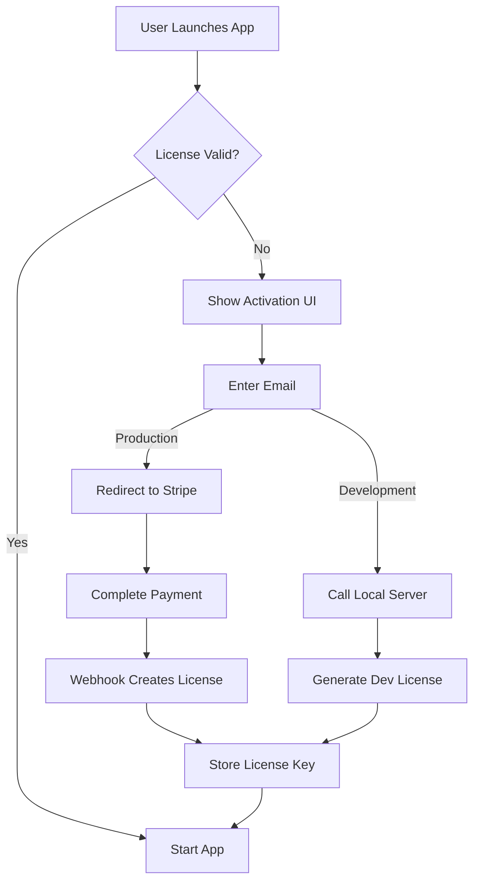

# A-B/AI License Setup Guide

This guide covers the complete setup process for the A-B/AI licensing system using Stripe for payment processing and Fastify for the license server.

## Table of Contents

1. [Architecture Overview](#architecture-overview)
2. [Development Setup](#development-setup)
3. [Stripe Configuration](#stripe-configuration)
4. [Production Setup](#production-setup)
5. [Testing the License Flow](#testing-the-license-flow)
6. [Troubleshooting](#troubleshooting)

## Architecture Overview

The A-B/AI licensing system consists of three main components:

1. **License Server** (Fastify) - Handles license activation and validation
2. **Stripe Integration** - Manages payments and subscriptions
3. **Electron App** - Validates licenses on startup with offline caching

### License Flow



## Development Setup

### 1. Install Dependencies

```bash
# Install all project dependencies
pnpm install
```

### 2. Local License Server

The development license server is located at `scripts/licence-server.ts`:

```typescript
import Fastify from 'fastify';
import { v4 as uuidv4 } from 'uuid';

const app = Fastify();
const keys = new Map<string, { created: number; seats: number }>();

app.post('/activate', async (req, res) => {
  const { email } = req.body as { email: string };
  const key = uuidv4();
  keys.set(key, { created: Date.now(), seats: 1 });
  return res.send({ licenceKey: key });
});

app.post('/validate', async (req, res) => {
  const { key } = req.body as { key: string };
  return res.send({ valid: keys.has(key) });
});

app.listen({ port: 4100 }, (err) => {
  if (err) {
    console.error(err);
    process.exit(1);
  }
  console.log('License server running on port 4100');
});
```

### 3. Run Development Environment

```bash
# This starts UI, Main, and License server concurrently
pnpm dev
```

The license server will be available at `http://localhost:4100`.

## Stripe Configuration

### 1. Create Stripe Account

1. Sign up at [https://stripe.com](https://stripe.com)
2. Navigate to your [Stripe Dashboard](https://dashboard.stripe.com)

### 2. Set Up Products and Pricing

1. Go to **Products** in the Stripe Dashboard
2. Click **Add Product**
3. Configure your product:

   - Name: "A-B/AI License"
   - Description: "Full access to A-B/AI desktop application"
   - Pricing model: Subscription or One-time

4. Create a price:
   - For subscriptions: Set monthly/yearly pricing
   - For one-time: Set a fixed price
   - Note the Price ID (e.g., `price_1ABcDeFgHiJkLmNo`)

### 3. Get API Keys

1. Navigate to **Developers > API keys**
2. Copy your keys:
   - **Publishable key**: `pk_test_...` (for development) or `pk_live_...` (for production)
   - **Secret key**: `sk_test_...` (for development) or `sk_live_...` (for production)

### 4. Update Configuration

Update `apps/ui/src/shared/stripe.ts`:

```typescript
export const STRIPE_PRICE_ID = 'price_1ABcDeFgHiJkLmNo'; // Your actual price ID
export const STRIPE_PK = 'pk_live_ABcDeFgHiJkLmNoPqRsTuVwXyZ'; // Your publishable key
```

## Production Setup

### 1. License Server Setup

Create a production license server with proper database storage:

```typescript
// production-license-server.ts
import Fastify from 'fastify';
import { v4 as uuidv4 } from 'uuid';
import Stripe from 'stripe';

const stripe = new Stripe(process.env.STRIPE_SECRET_KEY!, {
  apiVersion: '2024-12-18.acacia',
});

const app = Fastify();

// Database connection (PostgreSQL, MongoDB, etc.)
// import { db } from './database';

// Webhook endpoint for Stripe
app.post('/webhook', async (req, res) => {
  const sig = req.headers['stripe-signature'];
  const endpointSecret = process.env.STRIPE_WEBHOOK_SECRET!;

  try {
    const event = stripe.webhooks.constructEvent(req.body as string, sig as string, endpointSecret);

    switch (event.type) {
      case 'checkout.session.completed':
        const session = event.data.object;
        const email = session.customer_email;

        // Generate and store license key
        const key = uuidv4();
        // await db.licenses.create({
        //   key,
        //   email,
        //   stripeCustomerId: session.customer,
        //   stripePriceId: session.line_items?.data[0]?.price?.id,
        //   created: new Date()
        // });

        // Send license key via email
        // await sendLicenseEmail(email, key);
        break;
    }

    return res.send({ received: true });
  } catch (err) {
    console.error('Webhook error:', err);
    return res.code(400).send(`Webhook Error: ${err.message}`);
  }
});

// Validate endpoint
app.post('/validate', async (req, res) => {
  const { key } = req.body as { key: string };

  // Check database for valid license
  // const license = await db.licenses.findOne({key});
  // return res.send({valid: !!license});

  // Placeholder for demo
  return res.send({ valid: true });
});

app.listen({ port: 4100 }, '0.0.0.0', (err) => {
  if (err) {
    console.error(err);
    process.exit(1);
  }
  console.log('Production license server running on port 4100');
});
```

### 2. Deploy License Server

Options for deployment:

#### Option A: Deploy to Vercel/Netlify Functions

```typescript
// api/validate.ts
export default async function handler(req, res) {
  if (req.method !== 'POST') {
    return res.status(405).json({ error: 'Method not allowed' });
  }

  const { key } = req.body;
  // Validate against database

  res.json({ valid: true });
}
```

#### Option B: Deploy to VPS (DigitalOcean, AWS EC2, etc.)

```bash
# On your server
git clone https://github.com/skylordafk/A-B-AI.git
cd A-B-AI
pnpm install --production
node production-license-server.js
```

#### Option C: Use a managed service (Render, Railway, etc.)

1. Connect your GitHub repository
2. Set environment variables
3. Deploy with one click

### 3. Configure Stripe Webhooks

1. In Stripe Dashboard, go to **Developers > Webhooks**
2. Click **Add endpoint**
3. Enter your endpoint URL: `https://your-domain.com/webhook`
4. Select events to listen for:
   - `checkout.session.completed`
   - `customer.subscription.created`
   - `customer.subscription.deleted`
5. Copy the webhook signing secret

### 4. Environment Variables

Set these environment variables on your production server:

```env
STRIPE_SECRET_KEY=sk_live_...
STRIPE_WEBHOOK_SECRET=whsec_...
DATABASE_URL=postgresql://...
SMTP_HOST=smtp.example.com
SMTP_USER=noreply@example.com
SMTP_PASS=...
```

## Testing the License Flow

### Development Testing

1. **Start the development environment:**

   ```bash
   pnpm dev
   ```

2. **Test activation flow:**

   - Launch the app
   - It should show the activation screen
   - Enter an email address
   - Click "Activate License"
   - In dev mode, it will generate a local license

3. **Test validation:**

   - Restart the app
   - It should validate the stored license and start normally

4. **Test offline mode:**
   - Stop the license server (`Ctrl+C` in the terminal)
   - Launch the app
   - It should use the cached license (valid for 72 hours)

### Production Testing

1. **Test Mode in Stripe:**

   - Use test API keys
   - Use test card numbers (e.g., `4242 4242 4242 4242`)

2. **End-to-End Test:**

   ```bash
   # Set production environment
   export NODE_ENV=production
   export LICENCE_ENDPOINT=https://your-license-server.com

   # Build and run
   pnpm build
   pnpm start:prod
   ```

3. **Test Webhook:**
   ```bash
   # Use Stripe CLI for local webhook testing
   stripe listen --forward-to localhost:4100/webhook
   ```

## Troubleshooting

### Common Issues

#### 1. License Server Not Reachable

```
Error: Unable to validate licence. Please check your internet connection.
```

**Solutions:**

- Check if license server is running: `curl http://localhost:4100/validate`
- Verify `LICENCE_ENDPOINT` environment variable
- Check firewall settings

#### 2. Stripe Checkout Fails

```
Error: Failed to load Stripe
```

**Solutions:**

- Verify Stripe publishable key is correct
- Check if Stripe.js is loading properly
- Ensure price ID exists in your Stripe account

#### 3. License Not Persisting

```
Error: Your ABAI licence is invalid or expired.
```

**Solutions:**

- Check electron-store location: `~/Library/Application Support/abai-desktop/`
- Verify write permissions
- Clear cache and re-activate

### Debug Mode

Enable debug logging:

```typescript
// In checkLicence.ts
export async function checkLicence(serverURL: string): Promise<boolean> {
  console.log('[License] Checking license at:', serverURL);
  console.log('[License] Cache expires:', new Date(store.get('cacheExpires')));
  // ... rest of the function
}
```

### Manual License Management

For testing or emergency access:

```javascript
// In Electron DevTools console
const Store = require('electron-store');
const store = new Store();

// Set a manual license
store.set('key', 'manual-test-key-123');
store.set('cacheExpires', Date.now() + 72 * 60 * 60 * 1000);

// Clear license
store.clear();
```

## Security Considerations

1. **Never expose secret keys** in client-side code
2. **Use HTTPS** for all license server endpoints
3. **Implement rate limiting** on validation endpoints
4. **Log all license activations** for audit purposes
5. **Use webhook signatures** to verify Stripe events
6. **Implement license revocation** mechanism

## Next Steps

1. **Add License Management Dashboard**

   - View active licenses
   - Revoke/suspend licenses
   - Usage analytics

2. **Implement Team Licenses**

   - Multiple seats per license
   - License transfer between users
   - Usage tracking per seat

3. **Add Offline License Files**
   - Export license for air-gapped environments
   - Time-limited offline licenses
   - Hardware-locked licenses

## Windows-Specific Considerations

According to a memory from a past conversation, when running on Windows, ensure you use the correct path format:

### Correct Path Format

```bash
# Correct - Windows path format
cd C:\Users\skyle\OneDrive\Desktop\ABAI && pnpm dev

# Incorrect - This won't work properly
cd /c:/Users/skyle/OneDrive/Desktop/ABAI && pnpm dev
```

### Windows Firewall

The license server runs on port 4100. You may need to allow it through Windows Firewall:

1. Open Windows Defender Firewall
2. Click "Allow an app or feature"
3. Allow Node.js through the firewall
4. Or create a specific rule for port 4100

### Electron Store Location on Windows

License cache is stored at:

```
C:\Users\[USERNAME]\AppData\Roaming\abai-desktop\
```

## Support

For issues with the licensing system:

1. Check the [GitHub Issues](https://github.com/skylordafk/A-B-AI/issues)
2. Review server logs: `pm2 logs license-server`
3. Contact support with your license key (not the secret key!)
