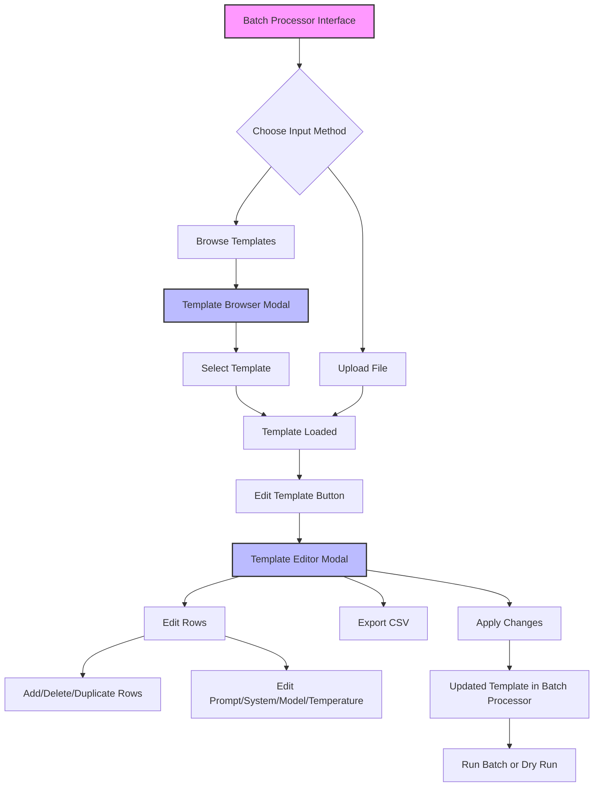

# Batch Template Editor

## Overview

The Batch Template Editor is a new feature in A-B-AI that allows users to edit batch processing templates directly within the application. This feature supports both pre-made templates from the Template Browser and user-uploaded CSV/JSON files.

## Feature Flow

## Key Features

### 1. Template Browser Integration

- Browse pre-made templates organized by category
- Categories include: general, creative, analysis, development, research
- Templates are fetched from GitHub repository
- Fallback to local templates if remote fetch fails

### 2. Template Editor

- **Split-panel interface**:
  - Left panel: List of all rows with preview
  - Right panel: Detailed editor for selected row
- **Row operations**:
  - Add new rows
  - Delete existing rows
  - Duplicate rows for quick replication
- **Field editing**:
  - Prompt (required)
  - System message (optional)
  - Model selection (8 supported models)
  - Temperature (0-2)

### 3. Export Functionality

- Export edited templates as CSV files
- Custom filename support
- Preserves all modifications

### 4. Bidirectional Editing

- **From Template Browser**: Load and edit pre-made templates
- **From File Upload**: Upload and edit CSV/JSON files
- Original templates remain unchanged (only loaded copy is edited)

## Usage

### Loading a Template

1. Click "Browse Templates" on the batch processor page
2. Select a template from the browser
3. Template is automatically loaded into the batch processor

### Editing a Template

1. Click "Edit Template" button after loading a file/template
2. Use the editor to:
   - Select rows from the left panel
   - Edit fields in the right panel
   - Add/delete/duplicate rows as needed
3. Click "Apply Changes" to save edits
4. Or click "Export CSV" to download the edited template

### Running Batch Processing

After editing:

1. Review the edited template in the batch processor
2. Click "Dry-Run Estimate" to preview costs
3. Click "Run Batch" to process all prompts

## Technical Implementation

### Components

- `TemplateBrowser.tsx`: Modal for browsing and selecting templates
- `TemplateEditor.tsx`: Full-featured editor for batch templates
- `templateService.ts`: Service for fetching and managing templates

### Data Flow

1. Templates fetched from GitHub manifest
2. Parsed into BatchRow format
3. Edited in memory
4. Applied back to batch processor state
5. Processed through existing batch pipeline

## Benefits

- **No external tools required**: Edit templates directly in the app
- **Visual editing**: See all rows and fields in an organized interface
- **Safe editing**: Original templates preserved
- **Flexible workflow**: Edit at any point before running batch
